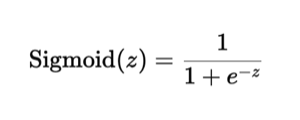

# pitch-model

## Abstract 

According to Yahoo Finance, the sport analytics market is projected to be valued at US$ 31.4 billion by 2034. This is due to the incredible prospect of improving athletic performance, team strategies, and business aspects within the sports industry through sports analytics. 

The machine learning model proposed will:
- Feature selection for calculating swing probability
- Predicting swing probability
- Predicting hit probability
- Analyze pitcher and batter performance

First, the model will identify the most important features through various feature selection techniques from both game situations (ie. score, inning, runners, count, outs, pitch hand, bat side, etc.) and pitch features (pitch location, release point, and Statcast metrics, etc.) to calculate the swing probability. This model will use Recursive Feature Elimination (RFE) using a logistic regression estimator to identify the most relevant features by recursively removing less important features. The swing probability calculated will then be used as an input along with pitch features to calculate a hit probability. Finally, we will use logistic regression to find the swing and hit probability, accuracy, and F1 score. 

Logistic regression applies a sigmoid function to represent the probability:

  

Where z is the output of the linear equation, w are the weights, x are the feature data, b is the bias: 

Using this information, both pitcher and batter performance can be analyzed in comparison to these probabilities. This means we could predict a positive pitch or hit from various features and potentially know the play before it happens, thus improving athletic performance and game strategy. 

## Data Set
The 2023 MLB regular season pitch data set is available here: https://drive.google.com/file/d/1VdqB_q9YrbgDUZklgIYjYFNeFRTIUJ4-/view?usp=drive_link

Sample videos to illustrate pitch zone location are available here: https://drive.google.com/drive/folders/1ytJQ8hHBSVvnIjO1c7S1ykq3eqEmdHYY?usp=sharing

## Features

### game_id
Unique identifier for a game

### play_id
Uniquely idenifies a given play.  Plays generally begin with a pitch and continue until play stops. 
 Plays may include batted balls and runner movement.  In certain situations, a play may be associated with a non-pitch such as a pick off attempt or runner advancement
 
### month_number
Numeric value representing the month of the game date

### year
Numeric value representing the four digit year of the game date 

### game_date 
The original date a game was scheduled to be played.  The actual game date may differ if the game was delayed.

### at_bat_number 
A sequential number associated with each "at bat" during a game

### pitch_number
A sequential number associated with each pitch of an at bat

### pitcher_id
Unique identifier associated with a pitcher

### pitcher_team_id
Unique identifier associated with the team a pitcher plays for

### pitch_hand
Character value either L or R indicating the hand the pitcher uses to throw (meaning Left or Right) 

### batter_id
Unique identifier associated with a batter

### batter_team_id
Unique identifier associated with the team a batter plays for

### bat_side
Character value either L or R indicating the side of the plate the batter stands during the at bat (meaning Left or Right)

### bat_side_multiplier
A value of 1 for a right handed batter or -1 for a left hand batter.  The value is used to normalize the pitch zone location

### count_balls_strikes
A character string that indicates the numeric value for balls and strikes, seperated by a hyphon.  For example, a count with 2 balls and 1 strike is '2-1'

### count_outs
Numeric value indicating the number of outs at the time of the pitch

### runner_string
A character string that indicates runner positions on the bases.  The first character is first base, the second character is second base, and the third character is third base.  If the base is occupied, a 1 is assigned.  If the base is not occupied, a 0 is assigned.  For example, a runner on second and third is '011'. 

### inning
Numeric value indicating the inning

### pitcher_team_score
Numeric value indicating the score of the defensive team

### batter_team_score
Numeric value indicating the score of the offensive team

### hit
If the ball is in play, a value of 0 or 1 indicates if the scorer ruled it was a hit.  This does not mean the ball was simply put into play.

### swing
A value of 0 or 1 indicating whether or not the batter swung at the pitch

### swing_miss
A value of 0 or 1 indicating whether or not the batter swung and missed.  Bunts are not included.

### swing_contact
A value of 0 or 1 indicating whether or not the batter made contact with the pitch.

### pitch_result
A categorical value indicating what happened on the pitch.  Typical values include: Ball, Called Strike, Swinging Strike, Hit Into Play No Outs, Hit Into Play Outs

### pitch_strike
A value of 0 or 1 indicating if the pitch was a strike (called, swinging, foul)

### pitch_ball
A value of 0 or 1 indicating if the pitch was called a ball

### pitch_type 
Two character code used to indicate the type of pitch thrown. pitch_type_desc expands the name.

### hit_into_play 
A value of 0 or 1 indicating if the batter swung and put the ball in play.  Foul balls do not count unless the foul ball is caught for an out.

### spin_rate
Floating point value indicating the number of revolutions per minute the pitch spins during flight.

### extension 
Floating point value indicating the distance at which the pitcher releases the ball.  The pitching plate is located 60' 6" from the apex of home plate.  Extension is measured as a y value perpindicular to a straight line between home and the pitcher's plate.

### pitch_speed 
Floating point value indicating the pitch speed in miles per hour when the ball left the pitcher's hand

### spin_angle
Floating point value that identifies the angle of the axis at which the pitch is spinning during flight

### vertical_break_induced
Floating point value that indicates the distance (in inches) the pitch moved from a line it would have traveled with only gravity affecting it

### horizontal_break   
Floating point value that indicates the distance (in inches) the pitch moved on a horizontal plane

### plate_speed
Floating point value that indicates the speed the ball is traveling when it reaches home plate (in miles per hour)

### pitch_minus_plate
Floating point value that is the difference between 'pitch speed' and 'plate speed'

### inferred_backspin_rate
Floating point value that indicates the number of revolutions the ball spins on a horizontal axis

### inferred_sidespin_rate
Floating point value that indicates the number of revolutions the ball spins on a vertical axis

### inferred_gyrospin_rate
Floating point value that indicates the number of revolutions the ball spins on a 45 degree axis

### relative_strike_zone_location
Floating point value that indicates the distance (in inches) from the center of the strike zone as the ball crosses home plate

### relative_strike_zone_location_x
Floating point value that indicates the distance (in inches) on a horizontal plane from the center of home plate

### relative_strike_zone_location_z
Floating point value that indicates the distance (in inches) on a vertical plane from the center of the strike zone

### normalized_strike_zone_location_x
This value is calculated by multiplying bat_side_multiplier by relative_strike_zone_location_x to normalize pitch zone location

### plate_location_x
Floating point value that indicates the distance (in inches) on a horizontal plane from the center of home plate

### plate_location_z
Floating point value that indicates the distance (in inches) on a vertical plane from the ground

### backspin
Seems to be the same as inferred_backspin_rate

### sidespin
Seems to be the same as inferred_sidespin_rate

### gyrospin
Seems to be the same as inferred_gyrospin_rate

### pitch_release_position_x 
Floating point value that indicates the distance (in feet) from a perpendicular line from the apex of home plate through the center of the pitcher's plate in which the ball is released

### pitch_release_position_y
Floating point value that indicates the distance from the ground (in feet) where the ball is released

### pitch_release_position_z
Floating point value that indicates the distance from the apex of home plate (in feet) where the ball was released

### pitch_location_zone 
Normalized zone decribing where the pitch crosses the plate.  A visual representation is available here: https://docs.google.com/document/d/1eRzfZ7Q4lfMKI-P5wE7UvGP3jzJEbd10sX2-Bh9jK6Y/edit?usp=sharing

### pitch_type_desc 
Text field that describes the type of pitch thrown
